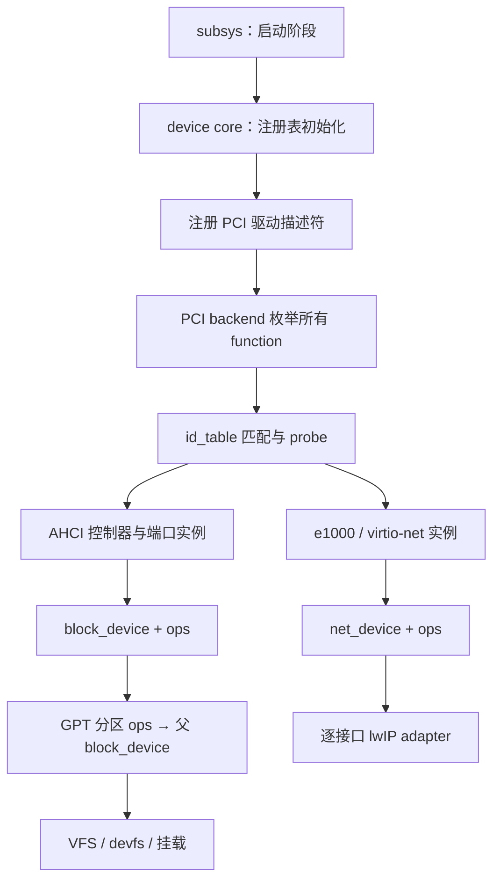

# ARCH-9：驱动模型 / 总线抽象设计

日期：2026-10-05

状态：子 agent 三轮评审后 APPROVE，待用户评审；本文不表示实现已完成。

## 1. 目标与范围

对应 `docs/roadmap.md` 的 ARCH-9：统一 PCI 设备发现和驱动绑定，支持 e1000 / virtio-net 及同类多网卡共存，块层通过驱动提供的 ops 访问硬件，为 NVMe / USB 后续接入提供边界。

用户明确要求：**可选设备不存在时可以跳过初始化**。本设计将“未发现设备”“设备不受支持”“设备初始化失败”和“启动必需能力缺失”分别处理。无网卡的普通启动不应失败；无根盘的完整系统启动不能伪装成功。

首期覆盖 PCI、AHCI、e1000、当前已实现的 legacy/transitional virtio-net 和 GPT 分区包装。保留 subsys 启动阶段，不承担 ARCH-8 的整体改造；不实现热插拔、动态卸载、ACPI AML、aarch64 ECAM、virtio modern/MMIO、NVMe、USB、异步块请求或块缓存。保留这些扩展的接口位置。

## 2. 现状依据

以当前仓库源码为依据，文档旧示例与源码冲突时以源码为准。

| 位置 | 当前行为 | 本项需要解决的问题 |
|---|---|---|
| `kernel/driver/pci.c` | `pci_find_device()` 每次递归扫描并返回首个 class 匹配；含 x86 config-port、Q35 IRQ 路由和 MSI 操作 | 枚举一次，保留所有 function；发现、匹配和平台访问分离 |
| `kernel/driver/ahci.c` | `ahci_init()` 为 void；找不到控制器或 ABAR 错误直接返回；wrapper 始终返回 0；全局 `g_hba` / `ahci_ports` | 传播实际结果，以控制器实例持有端口与 DMA 状态 |
| `kernel/net/net.c` | 首张 Ethernet 卡，非 virtio vendor 一律尝试 e1000；`is_virtio`、`net_hw_ok`、单个 `os01_netif` | 精确匹配设备；逐网卡绑定、收发和 lwIP 接入 |
| `kernel/driver/e1000.c`、`virtio-net.c` | 硬件、队列、MAC、netif 指针为全局；e1000 MSI-X 固定 0x30/GSI 16；virtio 直接使用 x86 I/O port | 私有状态实例化；IRQ 冲突不能覆盖已有 handler；不宣称支持未实现的 modern transport |
| `kernel/intr/irq.c` | `register_irq()` 直接覆盖 GSI 对应的单个 handler | 多设备需避免槽覆盖；不能仅改 net.c 就声称支持多网卡 |
| `kernel/block/blockdev.c`、对应头 | 默认调用 AHCI；公开 `port_num`；raw 注册后才补 read/write | 注册完整 ops，通用块层不理解控制器或端口 |
| `kernel/fs/gpt.c` | 分区直接调用 parent 的 read/write；注册后赋回调 | 分区使用同一注册 API，并经块层入口访问父设备 |
| `kernel/fs/boot.c` | 首块盘做 GPT/根挂载；零块设备直接返回 | 保持现有默认盘选择；明确根挂载缺失的启动诊断 |
| `kernel/subsys/subsys.c` | OPTIONAL 任意错误都打印 SKIP；`subsys_status()==1` 表示初始化成功 | 设备状态单独记录；不把硬件故障归类为“不存在” |
| `kernel/net/socket.c` | getsockname / getifaddr 直接引用 `os01_netif` | 改用默认接口查询，维持现有 syscall ABI |

网络现有两阶段启动需保留：phase 6 准备硬件，post-SMP/pre-task_init 建立 lwIP 与 tcpip_thread。aarch64 当前 `ARCH_ENABLE_LWIP=0`，本项只要求其构建与启动无回退，不承诺 aarch64 PCI/NIC 功能。

## 3. 方案选择

| 方案 | 收益 | 代价 / 局限 |
|---|---|---|
| **推荐：小型 PCI 模型 + 网络/块设备 ops** | 达成 roadmap 三个目标；总线负责匹配，设备类别负责服务，逐步迁移可回归 | 要拆驱动全局状态，明确生命周期和 IRQ 降级 |
| 只包装现有 init 为 probe | 修改较少 | 扫描首设备、单例状态、块层 AHCI 默认回调仍在，不能完成 ARCH-9 |
| 完整通用 device/bus/class 框架 | 易扩展大量总线和动态设备 | 当前无 hotplug/refcount/power-management 需求，首次引入过多机制 |

首期不建立通用 `bus_type` 虚函数层。建立少量通用 device 身份/状态/父子关系，PCI 使用强类型接口；将来 platform / USB / virtio bus 可共享 device 基础对象和 net/block 服务，不需要伪装成 PCI。



## 4. 层次与文件布局

新增目录必须保持源目录和公开头目录对称。

| 目录 / 文件 | 职责 |
|---|---|
| `kernel/device/core.c` ↔ `kernel/include/device/device.h` | 设备身份、父对象、状态、最后错误；启动期间登记与查询 |
| `kernel/device/boot.c` ↔ `kernel/include/device/boot.h` | 注册表、驱动登记、总线枚举和绑定的确定顺序 |
| `kernel/bus/pci/{core,match}.c` ↔ `kernel/include/bus/pci/{pci,driver}.h` | PCI 描述符、枚举调度、id_table 匹配、probe/remove |
| `kernel/arch/x86_64/bus/pci.c` ↔ `kernel/include/arch/x86_64/pci.h` | config port、Q35 路由、现有 MSI/MSI-X 硬件访问 |
| `kernel/include/arch/pci.h`，必要的 `kernel/bus/pci/platform.c` | backend 契约；无 backend 时明确表示总线不可用 |
| `kernel/net/device.c` ↔ `kernel/include/net/device.h` | 网卡注册和逐设备收发接口 |
| `kernel/net/lwip.c` ↔ `kernel/include/net/lwip.h` | lwIP adapter、默认接口、地址策略 |
| `kernel/block/blockdev.c` ↔ `kernel/include/block/blockdev.h` | 保留既有块层入口，改为纯 ops 调用 |
| 现有 `kernel/driver/*.c` ↔ `kernel/include/driver/*.h` | PCI driver 描述符、硬件 probe、私有状态与资源清理 |

迁移后删除 `kernel/driver/pci.c` 和旧 `driver/pci.h`；过渡头只允许存在于中间阶段，最终调用者使用新公开头。更新 Makefile 源文件集合及两个 profile 的链接边界；aarch64 不链接 x86 backend 或 I/O-port 驱动。不借此搬迁无关驱动。

## 5. PCI 设备与驱动契约

### 5.1 描述符与匹配

`device` 含稳定内部 ID、name、parent、状态和 last_error；`pci_device` 内嵌 device，包含 domain/BDF、vendor/device/subsystem ID、class/subclass/prog_if、BAR 描述、绑定 driver 与 `driver_data`。所有字段使用明确宽度，物理地址为 `uint64_t`。本项不修改 boot_context 或 UAPI。

`pci_device_id` 用 vendor/device/subvendor/subdevice 的明确 wildcard 和 `class_value/class_mask` 表达匹配；不能用 ID 0 表示通配或列表终止。`pci_driver` 保存 id_table 指针及显式条目数量：

```c
int pci_register_driver(const struct pci_driver *driver);
int pci_enumerate(void);
int pci_bind_all(void);
/* pci_driver callbacks */
int probe(struct pci_device *pdev, const struct pci_device_id *id);
void remove(struct pci_device *pdev);
```

登记只登记描述符，不扫描、不初始化硬件。枚举后按 domain/BDF 顺序绑定；重复驱动名、重复 BDF、重复登记要拒绝。多个驱动匹配同设备时：精确 vendor/device 条目优先于 class 条目；同等级跨驱动冲突记为 FAILED，不能依赖链接顺序选赢家。单个驱动多个条目按显式表顺序选首条。probe 失败后不自动交给其他驱动。

- AHCI 只匹配 class/subclass/prog_if = `01/06/01`，删除“任何 SATA 控制器”fallback。
- e1000 首期仅登记当前明确支持并纳入测试的设备 ID（现有 QEMU 0x8086:0x100e）；额外型号逐个验证后加入。
- virtio-net 首期只登记支持的 transitional/legacy ID `0x1af4:0x1000`，并验证 I/O BAR/transport。modern-only `0x1041` 留为 UNBOUND；vendor 相同不代表 transport 受支持。

BAR 的空间类型、索引、地址与已验证范围由 PCI 层提供；驱动验证自身所需区域。首期不重新分配 BAR，不为获得 size 对运行中设备做破坏性 sizing。已知固定寄存器窗口可作为驱动所需映射长度，并检查类型、地址有效性及算术溢出。config 访问必须串行化，避免 CF8/CFC 配对被其他 CPU 打断。

### 5.2 枚举与 backend

backend 提供 config 读写及平台 IRQ 路由，x86 初期使用当前机制。PCI core 从 backend 声明的 root bus 枚举，扫描 function 0..7，保留当前对 Q35 的兼容；桥递归维护 visited bus bitmap 并校验 bus 范围，防止环路/重复扫描。

无 backend 表示 `BUS_UNAVAILABLE`，空总线表示枚举成功且设备数为零；不能将任意错误解释为无设备。错误分两层处理：

- **框架/总线级**：驱动登记冲突、注册表 OOM、backend 无法访问整个 root、无法维持枚举记录完整性，返回 coordinator 错误并阻止依赖阶段继续。
- **单 function 级**：身份已读出后的 config 字段读取失败、非法 BAR/资源描述，保留 domain/BDF 和已知身份，记 FAILED + errno，禁止该 function 的 probe/MMIO/DMA，继续枚举并绑定其他健康设备。vendor 读取失败若 backend 能定位为单 function，也保留 BDF 的 FAILED 记录（身份字段标为未知）；只有成功读到 absence sentinel 才判定“不存在”。无法定位故障范围的 backend 错误按总线级失败处理。

bridge 的 bus 描述非法仅隔离该 bridge 及无法可靠发现的下游分支，不猜测下游不存在，其他可达分支继续；记录 `ENUMERATION_INCOMPLETE` 和错误 BDF。若该分支提供必需能力，其缺失最终由消费层拒绝。`pci_enumerate()` / `pci_bind_all()` 的返回值只表示框架级成败，单设备错误另保存在记录和汇总中。

无驱动匹配的 PCI function 保留 UNBOUND，禁止开启其 bus mastering 或访问其 MMIO 寄存器。

设备表使用堆分配链表，枚举和 probe 在 BSP/AP 启动前串行完成；既有 net/block 设备表容量治理保留为独立议题，不把 ARCH-10 的全部动态化纳入本项。容量耗尽必须失败且不发布半成品。

## 6. 可选设备缺失、失败与生命周期

### 6.1 状态和返回值

PCI 设备状态：`DISCOVERED → PROBING → BOUND`；无匹配为 `UNBOUND`；已匹配但 probe 返回硬件/资源错误为 `FAILED`。`last_error` 保留 errno。驱动注册成功不等于存在绑定设备。

| 情形 | 处理 | 启动策略 |
|---|---|---|
| 可选 NIC/AHCI 完全未枚举到 | 不调用其 probe；按 driver 统计 `SKIPPED_ABSENT` | info/debug，一次记录，继续 |
| bus backend 不存在 | 记录 BUS_UNAVAILABLE；不做 I/O/MMIO 试探 | 无该总线需求的 profile 正常继续 |
| PCI 设备无支持驱动 | UNBOUND，无副作用 | debug，继续 |
| probe 发现 transport/能力不适用，返回 `-ENODEV` | 完整回滚，记录 UNBOUND + 原因 | 继续，不称为“物理设备不存在” |
| 已匹配设备发生 timeout / I/O / OOM / IRQ 无可用替代 | FAILED，保存实际 errno，安全回滚；DMA 无法停止时见 §6.2 | log_err；仅已安全隔离的可选设备可继续 |
| 一个 AHCI 端口无介质 | 不分配其 DMA，不注册块设备 | debug，继续扫描其他端口 |
| 已确认介质的 IDENTIFY/I/O 失败 | 端口 FAILED；不注册该盘 | 报错，健康端口仍可用 |
| 正常 profile 无可挂载根盘 | 消费层明确报“root filesystem unavailable” | 在启动 init 前失败；不能标成可选 SKIP |

“可选”是 profile/消费者对能力的要求，不是 PCI driver 永久属性。正常系统网络可选、根文件系统必需；network 测试明确要求 NIC；专门的无盘探测测试可停在驱动阶段并验证后续错误诊断。

ARCH-9 不修改现有所有 OPTIONAL 子系统语义：驱动阶段的登记/枚举器为框架必需入口，不设置 OPTIONAL；它对单设备 FAILED 独立记录并继续。其自身登记/枚举失败必须明确阻止进入依赖它的启动阶段，不能依赖当前 subsys 的“打印 FAIL 后继续”。由 device boot 入口保存结果，平台启动边界检查并报致命错误；ARCH-8 后续可用统一必需失败策略替换这段过渡检查。无 backend 是可接受结果，不是框架失败。

PS/2、serial、framebuffer 等平台设备保留现有路径；本项不把它们强行迁到 PCI，也不把鼠标探测 timeout 一律改成 ENODEV。设备不存在如果只能通过主动探测确认，仍需有界探测；“跳过初始化”不代表能省掉所有发现操作。

### 6.2 资源所有权与 remove

- `probe==0` 前驱动必须完成硬件准备及 net/block 注册；绑定状态最后发布。BAR 映射、DMA 页、IRQ、私有对象均有明确所有者。
- probe 失败由 probe 自行按逆序 unwind；core 不调用只适用于成功实例的 remove。确认硬件静止后清空 driver_data，回收 IRQ、DMA 和私有资源，不保留可访问服务对象。无法确认静止时执行下述隔离/致命策略，不能先释放资源。
- 成功后的 remove 在无人使用、无挂载/分区引用、网络 adapter 已移除的静止条件下调用；首期仅用于受控测试/启动回滚，不提供运行期卸载 API。
- 停止设备 DMA 并屏蔽设备中断，解除自己持有的 IRQ，再释放队列/页。不能对未持有的 GSI 调用 unregister_irq，不能释放仍可能被硬件写入的页。
- DMA 停止/复位须有界并验证硬件状态。若无法确认静止，驱动转 FAILED，拒绝新的服务访问；将仍可能被硬件访问的页、命令表和私有状态移交隔离记录，保留至关机，不进入 allocator。若硬件仍可能写入隔离区以外的内存或无法安全屏蔽中断，返回独立的 `DEVICE_UNSAFE` 致命结果，由启动/运行期故障边界停止系统。可选设备也不能绕过这一要求。隔离资源不是可访问设备对象，也不是宣称“完整回收”的成功；汇总必须记录隔离数量。
- 共享的高半区 MMIO 映射不能无条件 unmap；无映射引用计数时映射保留至关机，释放驱动的所有权记录；确认硬件静止且不属于上述隔离记录的 DMA/IRQ/私有内存仍必须回收。
- 启动期服务注册允许反向撤销未被消费的对象；撤销后不能压缩/搬动其他已发布 block_device 的地址。正常运行对象存活至关机。

## 7. 网络设备抽象与多网卡

每张网卡拥有 `net_device`：name（按成功绑定顺序 eth0/eth1）、parent device、MAC、MTU、link 状态、ops、priv。e1000 寄存器/ring/RX 软件队列/锁，以及 virtio io_base/vnet/TX indices 全部移入私有实例，handler 参数指向该实例。

首期 `net_device_ops` 采用已有包类型以控制迁移范围：`xmit(ndev, struct pbuf *)`、`poll_rx(ndev, budget)`、`get_link(ndev)`、`stop(ndev)`。pbuf 只作前置声明，lwIP netif 结构和 adapter 初始化留在 net/lwip.c；本项保留对 pbuf 的依赖，将来的协议栈无关 packet 类型另立任务。

TX 为同步拷贝/提交：成功或失败均不接管调用者 pbuf；RX 驱动创建 pbuf，交 adapter，adapter 成功接管，失败由提交方释放。统一一个 RX 投递入口，不在硬件驱动内安装各自的 netif input。把现有 e1000 的 tcpip-thread 内 Ethernet input 和 virtio 的 tcpip_input 差异集中到 adapter；统一让 tcpip_thread 内执行 ethernet_input，避免同一线程向自身 mailbox 堵塞投递。

每张成功注册网卡对应独立 netif，`netif->state = ndev`，linkoutput 调用 ops。tcpip_thread 逐卡轮询，每次每卡最多 64 个 RX 包；IRQ 只确认硬件状态并提示工作，不能与轮询线程同时消费 RX ring。保留 sys_arch 当前有界周期唤醒，使无 IRQ 的卡也能收包。

不能仅在 mailbox 为空时 poll：对 tcpip core mailbox 的 fetch 每次在检查/取出消息前执行一次各卡有界 RX sweep，且不持 mailbox 锁；消息存在时 sweep 后至多取出一条消息，保证持续 API/TX 消息不饿死 POLL 卡。其他 netconn/application mailbox 不触发硬件 poll。64 包预算用尽后仍处理 mailbox 消息，RX 和 API 两侧都不会无限占用循环；空 mailbox 继续走既有周期唤醒和 lost-wakeup 防护。

**IRQ 首期策略**：复用现有 IRQ 框架；NIC 申请槽前检查并独占，登记和启用顺序明确，禁止覆盖已占槽。当前 e1000 MSI-X 使用槽 16，只允许首个成功申请者使用；其余卡或冲突的 INTx 卡关闭设备中断及 PCI INTx（必要时禁用 MSI/MSI-X），进入已实现且测试通过的 polling 模式，不屏蔽别人拥有的 IOAPIC GSI。e1000 初始化 API 必须显式区分 MSIX / INTX / POLL 三种模式，POLL 不能误走旧 INTx 分支。virtio 同样提供 POLL 路径。轮询不是失败设备伪装成功：只有 TX/RX 和 link 检查均可工作才允许注册。IRQ 通用层增加“已占用则拒绝”的防覆盖检查作为必要小修，动态 vector 分配和 shared INTx handler 留后续任务。

无 NIC 时不调用 tcpip_init、不启动 DHCP。**必须新增网络服务就绪检查**：现有 do_socket/socket_alloc 在分配 netconn 前没有 readiness guard，不能沿用“已有错误路径”的假设。net/lwip.c 管理 OFF / STARTING / ONLINE / FAILED 状态，独立于 PCI BOUND 与物理 link_up；ONLINE 必须同时满足 tcpip core 已就绪和至少一个 adapter 成功接入。用 tcpip_init 的完成回调确认 core 就绪，结合 adapter 接入结果以 release/acquire 发布 ONLINE，不能仅因 tcpip_init 返回就宣称线程就绪，也不能在 pre-task_init 同步等待尚未调度的 tcpip_thread。

无 NIC、core 未就绪或全部 adapter 接入失败时，do_socket 在 netconn 分配之前返回 `-ENETDOWN`，内部 socket_alloc 同样检查且不调用 lwIP；不得将这类失败误报 ENOMEM。ONLINE 发布前 default-interface 查询返回空、getifaddr 返回 0，即使 adapter 已建立也仅视作启动内部状态；ONLINE 后仍无可用默认接口时 getifaddr 返回 0；其他 socket 操作先按现有规则验证 fd，没有成功创建的 socket 时返回 EBADF，不能触达未初始化 mailbox。全部 adapter 失败但 core 已启动时，保留 core 至关机、服务状态为 FAILED，不再次调用 tcpip_init；一次启动只允许初始化一次。link_down 不等于 core 未就绪，链路故障继续由既有路由/I/O 错误路径处理。

默认接口为首个成功接入 lwIP 的网卡；无可用接口则查询为空。`socket.c` 的 getifaddr 保留返回默认接口 IPv4 的现有 ABI；getsockname 优先实际 socket 绑定地址，仅未绑定时使用默认接口，消除 os01_netif 全局引用。

现有 QEMU 静态地址 10.0.2.15 兜底只作用于默认接口；其他卡初始地址为零，各自 DHCP，不能把同一静态 IP 复制到所有卡。link_up 依据驱动实际状态；一张接口 adapter/DHCP 失败不能阻止其他接口接入。首期不提供用户态接口枚举或配置新 ABI。

## 8. 块层解耦与 AHCI 实例化

统一注册接口以完整描述符为输入：name、sector_count、sector_size、ops、private_data、parent、设备类型（整盘/分区）；输出稳定 block_device 指针及明确错误码。ops 表含 read/write，flush 为可选；有效 read 是必需项，write 为空表示只读。sector_size 必须非零并受支持，name 长度及唯一性必须校验。先验证并填充全部字段，再发布 present；删除 register_raw 后补回调模式。

`block_device_t` 删除 port_num 和直接 read/write 字段，保留 ops 指针和 private_data。AHCI wrapper 放回 ahci.c，private_data 指向包含 controller 指针的 port 实例。每个 AHCI 控制器独立持有 HBA、端口数组、DMA 和每端口 I/O gate；gate 的 busy/port-state 仅以短 irqsave 锁维护，从准备 command/bounce-buffer 到完成或故障处置均独占，不能让 SMP 调用覆盖数据。等待 gate、硬件完成、停止/复位时不持 irqsave 锁，不因 I/O 序列化全程关闭本地中断。gate 竞争等待有界；到期返回 EBUSY，不接触持有者的 DMA 区。所有 AHCI 硬件等待使用已验证的 monotonic clocksource 和有界 deadline，禁止仅靠可能因调用者关中断而不推进的 jiffies。phase 4 已执行不代表时间源可用：AHCI probe 在开启 bus mastering、修改控制器、分配/启动 DMA 前，必须检查 clocksource_active 且 clocksource_freq_hz() 非零；不满足则返回 -ENOTSUP，设备 FAILED 并记录“reliable deadline clock unavailable”，健康的其他驱动继续处理；根能力缺失仍由挂载层拒绝。首期不以 jiffies 或固定循环次数作静默 fallback。pre-GS/BSP 阶段用 clocksource_cycles() 和已验证频率构造 deadline；运行期用已安装 GS 后的 clocksource_read_ns()（含 per-CPU TSC offset）构造 deadline，禁止跨 CPU 比较未经补偿的 raw TSC。有效时间源在设备存活期间保持稳定；运行期发现 inactive/零频率时不得发起新命令，未能证明现有命令已静止时执行 §6.2 的隔离/DEVICE_UNSAFE 策略。AHCI 多端口按 controller BDF / port 顺序分配全局唯一 hda/hdb 名称，保持现有单盘名称 hda。

控制器就绪但无盘可以绑定成功且注册零块设备。某端口失败不推翻其他健康端口；控制器级故障则撤销其已登记但尚未被消费的服务，并处置所有已获得资源。总线资源准备成功且部分端口可用的控制器保留 BOUND，逐端口故障单独记录。

请求 timeout 后在 gate 独占期间将端口标为 FAILED，拒绝下一请求；有界停止命令引擎/FIS 接收并确认设备不再访问命令区和 DMA 页。首期不自动重试写入、不恢复该端口为可用，也不复用其 bounce buffer；原请求返回 ETIMEDOUT，后续请求立即返回 EIO。若能确认静止，可在安全撤销服务之后释放相关资源；已发布且被引用的 block_device 对象保留稳定地址，present 标为不可用。停止失败走 §6.2 隔离或 DEVICE_UNSAFE 策略，不能在超时后归还页。IDENTIFY/probe timeout 同样适用。停止单端口失败时不得复位整个 controller 而影响健康端口；任何控制器级故障须禁用其所有端口并传播诊断。

块层所有请求经 `block_device_read/write()` 验证：使用 `lba <= sector_count && count <= sector_count - lba` 避免加法溢出；有效设备上的 count=0 为无操作，非零请求要求非空 buffer；写只读设备返回明确错误。请求超过驱动单次传输容量时，驱动拆分或明确拒绝，不能截断。GPT 自身仍只支持现有 512B 扇区格式，其他 sector_size 明确拒绝 GPT 解析，不能读入 512B 缓冲后溢出。

GPT partition_ops 使用 parent block_device_read/write，偏移转换先检查范围和溢出；分区 owner 为父 disk，private_data 为 partition_ctx，不出现 AHCI 端口字段。统一入口也为 ARCH-6 缓存按 (device identity, LBA) 接入提供边界，本项不添加缓存。devfs / FAT / ext2 保持通用块层调用，fs/boot 的首盘选择从整盘中选取，避免将分区误选为根盘候选；不引入新 UUID 启动配置。

## 9. 启动顺序与迁移边界

phase 3 IRQ controller → phase 4 timer → phase 5 既有平台设备 → phase 6 单一 device boot coordinator。

当前 phase 6 早于 x86_64_boot_percpu/GS 初始化：coordinator、device core、probe 及其失败清理不得调用无保护的 this_cpu()/cpu_id()，不得在日志/设备 ID 中隐式读取 per-CPU 状态。复用现有 slab 的 BSP 未 online 分支与不依赖 GS 的日志/短锁；lwIP/pbuf 分配及 sys_arch_protect 留到 post-SMP，phase 6 只准备硬件队列。此约束不改变既有 GS 设置时机。

具体顺序：

1. 初始化 device/net/block 注册表（一次性，不能清空已发布设备）。
2. 调用显式 driver descriptor 集合登记 AHCI/e1000/virtio-net；描述符保持在各驱动中。
3. 枚举 PCI，再按确定顺序匹配/调用 probe。
4. 汇总绑定、缺失、不支持、失败数量，检查框架结果。
5. 后续 fs_boot_prepare → devfs 块设备发布 → GPT/根挂载。
6. post-SMP/pre-task_init：按成功注册网卡接入 lwIP，然后原有 scheduler/user-space 启动。

coordinator 通过 `SUBSYS_INITCALL()` 登记，禁止在 kernel_main 硬编码硬件列表。驱动集合用专用链接段描述符或明确构建集合提供：首期选择专用 `.pci_drivers` 描述符段，x86 linker KEEP 并提供边界；段遍历只登记，匹配按第 5 节规则，不以段顺序决定绑定。aarch64 若不链接 PCI core 不添加悬空段边界引用。旧 AHCI 和 net-hw 的硬件 initcall 随迁移删除，防止双重初始化。

PCI core / backend 可独立测试；platform 调度与 subsys 结合，不扩大为完整启动 DAG。块层初始化从 AHCI 注册的隐式触发改成 coordinator 的明确前置。

## 10. 分阶段交付

| 阶段 | 修改范围 | 完成门槛 |
|---|---|---|
| A：块设备 ops | blockdev、AHCI wrapper、GPT、所有旧字段调用者 | 通用块层无 AHCI include/symbol/port_num；GPT 分区访问使用父块层入口；现有启动与读写回归 |
| B：PCI core 与 AHCI 迁移 | backend 分离、枚举/match、coordinator、AHCI 控制器实例与状态 | 多 function 枚举、精确匹配、无 AHCI 跳过、错误回滚、单盘命名和根挂载兼容 |
| C：多网卡与 adapter | net_device、e1000/virtio 状态、IRQ 防覆盖/POLL、lwIP、socket 默认接口 | 两种卡及同类双卡同时收发；零 NIC 启动；未知网卡不被错误驱动接管 |
| D：清理与验收 | 移除旧 pci_find_device 路径/旧头/旧 initcall，更新 driver/subsys/roadmap 文档 | ARCH-9 三条完成条件全部通过；不提前将 roadmap 标成完成 |

每个阶段可独立审查；以上是交付拆分，不代替实现时的逐步骤计划。更改结构体后按仓库要求 make clean，改变 profile/构建 flag 时按构建指南清理相应 profile，避免旧对象影响结果。

## 11. 验证与验收

### Host 测试

- fake PCI config：桥、多 function、空总线、循环桥、重复 BDF、错误读取；测试枚举一次而非每驱动扫描。
- id_table：精确 ID/class mask/wildcard、同级匹配冲突、未知 Ethernet、modern-only virtio 不匹配；无设备时 probe 调用计数为 0。
- 生命周期：probe 在 DMA/IRQ/服务登记等步骤注入失败，核对可安全回收的资源逆序释放、服务列表无残留，成功实例受控 remove 只清理自己的资源。停止失败时核对 DMA 页进入隔离记录而不回到 allocator，DEVICE_UNSAFE 阻止继续。
- AHCI 时间源：clocksource inactive 或频率为零时 probe 返回 ENOTSUP，bus-master/MMIO 写操作及 DMA 启动计数均为 0；已验证时间源不依赖 timer IRQ，运行期不降级至 jiffies；跨 CPU deadline 使用补偿后的时间读数。
- AHCI timeout：SMP=1 且 timer IRQ 不推进时 clocksource deadline 仍终止；gate 竞争有界且不持长 irqsave 锁；请求 timeout 后再次读写返回 EIO，旧命令区/bounce buffer 不复用；停止失败及 probe IDENTIFY timeout 验证隔离路径。
- 枚举错误隔离：坏 NIC BAR/config + 健康根盘/第二 NIC，坏 function FAILED、probe 计数为 0，健康设备仍绑定；总线级 backend 错误和注册表 OOM 才返回 coordinator 失败。
- net fake ops：两张卡独立 TX/RX、预算公平、pbuf 所有权、默认接口失败后选择下一接口、无 NIC 空查询；tcpip mailbox 持续非空时每次 fetch 仍 poll，非 core mailbox 不 poll。
- readiness：无 NIC、core STARTING、全部 adapter 失败时 socket 返回 ENETDOWN，netconn 分配调用计数为 0；getifaddr 为 0；只有 core 完成回调和成功 adapter 都满足才发布 ONLINE。
- IRQ 槽冲突不覆盖；POLL 模式不登记 IRQ，不能关闭另一张卡的 GSI。
- block fake ops：不依赖 AHCI 的内存盘、只读、零请求、越界/整数溢出、分区偏移和父入口调用；容量/注册失败不发布半对象。

### QEMU 矩阵

- 正常单盘 + e1000、单盘 + transitional virtio-net；phase-0 / inittab-phase / network 保持通过。
- `-nic none`：正常盘与 shell 启动成功，无硬件 NIC probe、无 DHCP，缺失统计可见；用户态实际调用 socket()，在 harness 的 2 秒上限内返回 ENETDOWN，getifaddr 为 0，无 mailbox 等待/断言。另以 adapter 全失败注入覆盖同样行为。
- e1000 + virtio-net；双 e1000；双 transitional virtio-net：每卡独立 netdev/netif/MAC/队列，各卡连接独立 QEMU netdev 和独立子网；以 DHCP/ARP、接口定向 RX 和响应验证每张卡，不能只观察默认卡一次 ping。
- IRQ 冲突布局：至少一张卡实际采用 POLL，两张卡收发均成功，原 handler 未被覆盖；在另一卡持续 TX/API 消息时，向 POLL 卡持续注入包并验证 RX/响应继续推进。SMP=1/2 都运行；默认 SMP=2 下并发 TX 与块读写不串数据。
- 无 AHCI / 空端口：firmware 仍需能载入内核。保留 boot image 但将控制器改为当前未支持的存储 transport，或 UEFI 将内核装入后测试禁用目标控制器；不能简单删除所有启动盘然后把 firmware 找不到 EFI 当作内核通过。断言驱动缺失/空端口行为，正常 profile 后续明确报告根盘缺失。
- 未支持 NIC 与故障注入：UNBOUND 不写 BAR；probe 错误显示 FAILED 和具体 errno，其他健康设备继续可用。
- aarch64 现有 UEFI / SMP 启动与 build contract 无回退；不把无 PCI backend 当成架构失败。

### 命令与静态检查

实现后运行 `make test-host`、`make test-static`、`make test-qemu SUITE=phase-0`、`make test-qemu SUITE=inittab-phase`、`make test-qemu SUITE=network`。syscall 回归使用 `make OS01_SYSTEST=1 test-syscall`，不混入 KERNEL_SELFTEST。内核自测另跑，按已有已知问题记录真实结果。双 profile 运行 build-contract，aarch64 测试使用 `docs/build/build.md` 的现有目标。新增多卡矩阵由 qemutests 扩展提供并纳入现有 harness。

test-static 补边界审计：通用 block 无 AHCI 符号；net adapter 无 e1000/virtio 分支；硬件驱动不主动 pci_find_device；新通用 PCI 文件无直接 x86 汇编、APIC 或硬编码高半地址；无旧 os01_netif 全局引用。MMIO/MSI 处理移到 backend 后仍需检查映射错误，不能假定 AHCI 顺便映射了 NIC BAR。

最终验收标准：枚举与绑定统一、多张网卡实际可用、块层可接非 AHCI fake driver、可选缺失被安全跳过、存在但失败有真实诊断、根能力缺失被明确拒绝、失败后没有可访问半初始化设备，无法确认 DMA 停止的资源被安全隔离或明确阻止系统继续。本文只提交设计，未执行实现测试。


## 12. Spec 评审记录

2026-10-05，子 agent `spec_reviewer` 按 superpowers requesting-code-review 只读评审，主 agent 按 receiving-code-review 核实源码并修订。

| 轮次 | 结论 | 处理结果 |
|---|---|---|
| 1 | REQUEST_CHANGES | 补齐 socket readiness、AHCI gate/timeout/DMA 隔离、单 function 错误边界，以及 mailbox 公平轮询和 pre-GS 约束 |
| 2 | REQUEST_CHANGES | 明确 clocksource 不可用时拒绝 probe、隔离资源的回收例外、ONLINE 前接口查询规则 |
| 3 | APPROVE | Critical / Important 均为零，无新增 Minor；前两轮意见全部解决 |

主 agent 接受评审者列出的首期范围排除：热插拔/运行期卸载、动态 vector/shared INTx、aarch64 PCI/NIC 功能、NVMe/USB/缓存/异步 I/O，以及独立的现有 FS 并发和 syscall 用户指针问题。评审针对设计可执行性，未验证尚未实现的功能。用户评审通过后才进入 writing-plans；本次不编写实现计划或修改产品代码。
